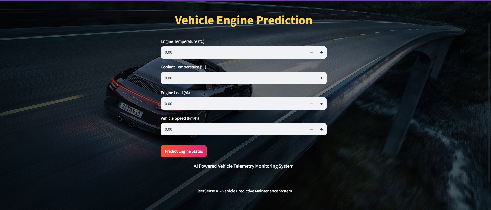
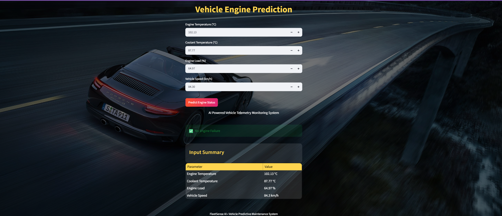

# 🚗 FleetSense AI - Vehicle Failure Prediction

FleetSense AI is a Machine Learning-based web application developed to predict vehicle engine failure using vehicle telemetry data. The application helps identify potential engine issues based on sensor readings, enabling predictive maintenance and reducing unexpected breakdowns.

---

## 📌 Project Overview

This project analyzes vehicle telemetry data and predicts whether an engine failure is likely to occur using a trained Machine Learning model. The application is deployed using Streamlit, allowing users to enter vehicle parameters and receive instant predictions.

---

## ✨ Features

- Predicts vehicle engine failure
- Interactive Streamlit web interface
- Real-time prediction
- User-friendly input form
- Machine Learning-based prediction model

---

## 🛠️ Technologies Used

- Python
- Streamlit
- Pandas
- NumPy
- Scikit-learn
- Joblib

---

## 📊 Dataset

The model is trained using a vehicle telemetry dataset containing sensor values such as:

- Engine Temperature
- Coolant Temperature
- Engine Load
- Vehicle Speed
- Fuel Level
- Engine RPM
- Oil Pressure
- Ambient Temperature

---

## 🤖 Machine Learning

- Data Preprocessing
- Feature Engineering
- Model Training
- Model Evaluation
- Prediction using trained model

---

## 🚀 How to Run

1. Clone the repository

```bash
git clone https://github.com/Geetha0304/FleetSense-AI.git
```

2. Install the required packages

```bash
pip install -r requirements.txt
```

3. Run the Streamlit application

```bash
streamlit run app.py
```

---

## 📸 Screenshots

### 🏠 Home Page



### ❌ Engine Failure Prediction


### ✅ No Engine Failure Prediction



---

## 🔮 Future Enhancements

- Deploy on Streamlit Cloud
- Improve prediction accuracy
- Add more vehicle parameters
- Enhance dashboard visualization

---

## 👩‍💻 Author

**Geetha Bhavani Betha**

- LinkedIn: https://linkedin.com/in/geetha2504
- GitHub: https://github.com/Geetha0304
